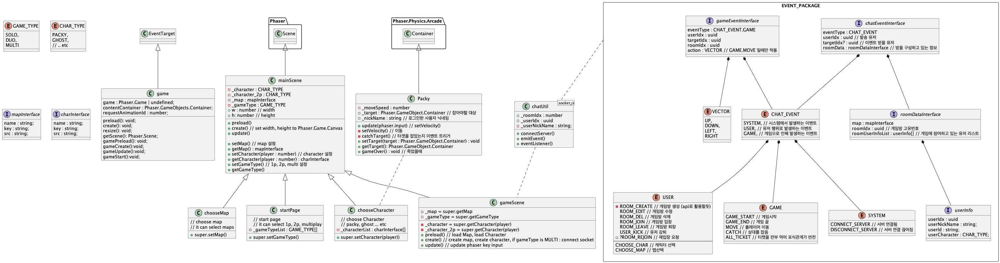

#  Packy

### 멀티 플레이 팩맨 게임

Packy는 인기 있는 레트로 게임 Pack-man에서 영감을 얻어 만들게 되었습니다
기존의 Pack-man게임은 1인용 게임으로, 유령을 피해 코인을 먹어 유령을 전부 잡는 게임이지만
Packy는 사람들과 멀티로 즐기는 게임입니다. 기존과 다르게 서로 잡고 잡히는 게임으로 멀티플레이의 짜릿함을 더했습니다.

### 게임설명
1. 로그인 / 회원가입
2. 게임 타입을 선택한다. (2player, multi)
3. 캐릭터를 선택한다.
4. 맵을 선택한다.
5. 플레이~

### 게임규칙
- #### 2 Player
  - 플레이어는 도둑과 술래로 나눠진다.
  - 술래는 도둑을 잡아야 한다.
  - 도둑이 티켓을 다먹은 경우 둘의 관게는 역전된다.
  - 상대를 잡은 사람이 승리

- #### Multi
  - 플레이어는 잡아야하는 대상과 도망가야하는 대상이 있다.
  - 예를들어 8명의 플레이어가 같이 게임을 진행할 때,
  - A < B < C < D < E < F < G < H < A
  - A는 D를 잡고, D는 C를 잡고, C는 B를 잡고, 서로 잡고 잡히는 구조다
  - 티켓을 다 먹은경우 자신과 나를 잡는 대상의 관계가 반전된다.
  - 예를 들어 B가 티켓을 다 먹은경우 
  - A < B > C < D < E < F < G < H 와 같이 관계가 반전된다.
  - C가 티켓을 다 먹은경우
  - A < B < C > D < E < F < G < H 와 같이 관계가 전부 반전된다.
  - 상대를 잡으면 상대의 역할이 전이된다. C가 D를 잡음
  - A < B < C < E < F < G < H
  - 상대를 잡을때마다 점수가 1점 오르며, 점수가 높은사람이 승리하게 된다.
  - 1대1인경우 점수가 높은 사람이 승리!
  - 동점인 경우 상대를 잡으면 승리!

### class

